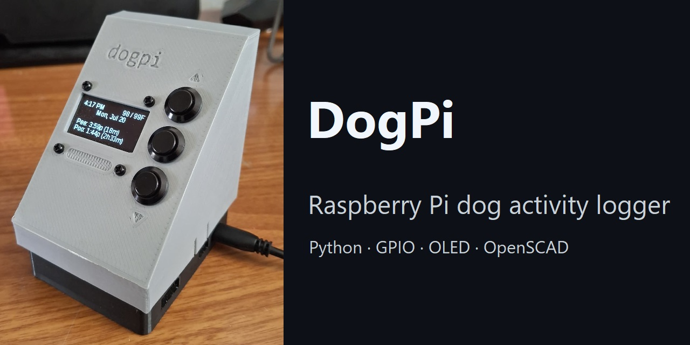
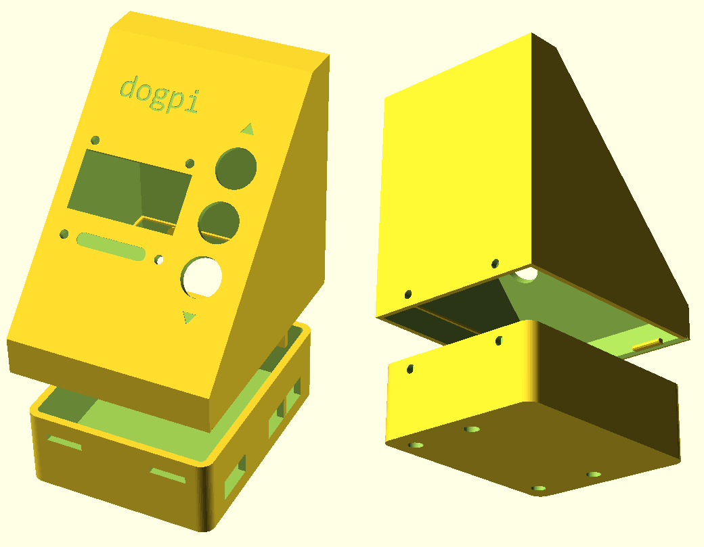

# DogPi

**A self-contained Raspberry Pi appliance for logging dog bathroom activity, checking recent history, and viewing local weather from a tactile three-button interface.**



## Project overview

Coordinating pet care in a shared household can be surprisingly difficult. DogPi provides a simple, shared record of bathroom breaks on a purpose-built device that stays near the door. With a few button presses, anyone can log a pee, poop, or both, including an estimated time for an event recorded later. The OLED shows how long it has been and the current weather at a glance.

The project combines software, electronics, and mechanical design into one working product. It uses a state-driven embedded UI, GPIO input, durable local storage, a fault-tolerant weather integration, automated tests, and a custom 3D-printable enclosure.

## Key features

- Physical three-button interface with a six-state OLED UI
- Timestamped activity logging for pee, poop, or both, with an adjustable "how long ago" picker
- At-a-glance status showing the most recent events and current temperature
- Current weather stats and a scrollable hourly forecast from Open-Meteo
- Cached weather data with refresh throttling and stale-data fallback
- 5 configurable animated idle screens with real-time motion and bounded frame pacing
- Undo support and atomic JSON persistence across restarts
- Parametric OpenSCAD enclosure with ready-to-print STL files
- Automated regression tests for networking, caching, parsing, screen conversion, and timezones

## Architecture and engineering highlights

DogPi keeps hardware concerns, application state, screen rendering, and external services separated. `app.py` acts as the composition root: it loads configuration, creates the HTTP and weather services, injects the weather dependency into the UI, and then registers GPIO callbacks.

```text
Three GPIO buttons ──> input callbacks ──> UI state + screen rendering ──> SH1106 OLED
                                              │
                                              └──> atomic JSON event log

config.json ──> app.py
                  ├──> HttpService ──> WeatherService ──> Open-Meteo
                  │                     ├── implements IWeatherService
                  │                     └── injected clock
                  │
                  └──> screens.py <──── IWeatherService
```

Notable design decisions include:

- **Testable service boundaries:** screens depend on `IWeatherService`, while `WeatherService` depends on `IHttpService`. Tests can supply fakes without GPIO hardware or live network calls.
- **Resilient weather behavior:** refresh attempts are throttled, failed requests preserve the last successful result, and the UI identifies cached results as stale rather than discarding useful data.
- **Deterministic time handling:** the weather service accepts an injectable clock and interprets forecast values in the timezone returned by the API.
- **Safe local persistence:** events are first written to a temporary file and committed with `os.replace`, reducing the risk of a partially written log.
- **Hardware-aware animation:** idle renderers update motion using elapsed time rather than frame count. Rendering cadence is capped separately at 40 FPS to balance smoothness against CPU and I2C load.
- **Configuration outside the code:** coordinates, units, requested forecast fields, refresh timing, and forecast intervals live in `config.json`.

## Hardware and enclosure

| Component | Details |
|---|---|
| Computer | Raspberry Pi with GPIO and I2C. Enclosure designed for a Pi Zero 2 W |
| Display | 1.3-inch SH1106 OLED, 128 × 64, I2C (`0x3C`) |
| Controls | 3x momentary buttons: UP on GPIO 22, SELECT on GPIO 27, DOWN on GPIO 17 |
| Enclosure | Two-part parametric OpenSCAD design with committed base and lid STLs |



The enclosure integrates the Pi, display, and three vertically arranged 12 mm panel-mount buttons into an angled desktop control panel. Its OpenSCAD source exposes the following variables so tolerances can be adapted to a specific printer or filament:
- Fit
- Wall thickness
- Panel angle
- Port clearance
- Button spacing
- Front-tab and captive-nut closure clearances

See [`cad/README.md`](cad/README.md) for dimensions, printing instructions, and fit details.

## UI and controls

The interface is organized around six explicit modes:

- **Idle:** 5 dynamic, burn in-resistant animated backgrounds and DVD-style bouncing clock
- **Status:** Current date and time, most recent pee and poop times, and current local temp/feels-like temp
- **Menu:** Select from log pee/poo/both, undo, current weather, and forecast
- **When:** Selectable hours and 0/15/30/45-minute offset to log an event
- **Weather:** Scrollable current weather conditions
- **Forecast:** Scrollable hourly forecast (24-hour by default)

| Screen | UP | SELECT | DOWN |
|---|---|---|---|
| **Idle** | Cycle backgrounds | Open status | Cycle font |
| **Status** | — | Open menu | — |
| **Menu** | Previous | Select | Next |
| **When** | Increment | Next field / confirm | Decrement |
| **Weather** | Scroll up | — | Scroll down |
| **Forecast** | Scroll up | — | Scroll down |

Hold **SELECT** for 0.6 seconds to return to previous mode. After 25 seconds without input, the display returns to idle mode.

## Setup and usage

### 1. Enable I2C

```bash
sudo raspi-config
# Interface Options -> I2C -> Enable
sudo reboot
```

OLED can be checked after reboot with `i2cdetect -y 1`
The default display address is `0x3C`.

### 2. Install dependencies

```bash
sudo apt update
sudo apt install -y python3-pip i2c-tools fonts-dejavu fonts-liberation fonts-freefont-ttf
pip3 install -r requirements.txt
```

### 3. Configure weather

Weather uses Open-Meteo and does not require an API key.
Edit `config.json` to set:
- `request_parameters.latitude` and `request_parameters.longitude` for the forecast location
- `request_parameters` for units and requested current/daily/hourly fields
- `refresh_interval_seconds` for the minimum interval between attempts (default: 600)
- `forecast_horizon_hours` for the number of upcoming entries retained (default: 24)

The committed coordinates point to Tucson, Arizona.

### 4. Run DogPi

Run from the project directory so the event log is read and written there:

```bash
python3 app.py
```

Events are stored locally in `dog_log.json`:

```json
{
  "events": [
    {"type": "dog", "value": "pee", "ts": "2026-02-18T14:30:00"},
    {"type": "dog", "value": "both", "ts": "2026-02-18T08:15:00"}
  ]
}
```

## Tests

Run the complete suite from the project directory:

```bash
python3 -m pytest -q
```

The tests exercise time and direction helpers, HTTP transport failures, weather parsing and caching, refresh throttling, stale-data fallback, timezone interpretation, dependency reuse, and conversion of service models into OLED-ready views.

## Project structure

```text
dogpi/
├── app.py                     Root, main display loop
├── config.py                  Configuration
├── config.json                Weather location, fields, units, and timing
├── hardware.py                GPIO buttons, SH1106 setup, shared fonts
├── inputs.py                  Button callbacks, state transitions
├── screens.py                 UI state, view models, and OLED rendering
├── state.py                   Atomic event persistence and lookup helpers
├── helpers/                   Time, direction, and numeric helpers
├── idle/                      Idle renderer, animated backgrounds
├── services/
│   ├── http/                  HTTP interface, implementation, response model
│   └── weather/               Weather interface, adapter, cache, data models
├── cad/                       Parametric OpenSCAD source, printable STLs
├── assets/                    Assembled device photo, enclosure render
├── tests/                     Automated regression suite
└── requirements.txt           Python dependencies
```

### Idle animation tuning

Idle motion uses elapsed seconds (`dt`), with speed constants expressed in per-second units. Frame pacing is configured independently in `idle/__init__.py`:

```python
IDLE_TARGET_FPS = 40.0
```

For an SH1106 display over I2C, 24–40 FPS is a practical tuning range depending on the desired smoothness and available CPU/I2C capacity.

## Potential next steps

- Add a short animated demo and a full video walkthrough of the hardware, UI, and enclosure
- Expand the weather screen with a navigable multi-day forecast
- Reuse the HTTP service abstraction for additional features
- Implement test automation with GitHub Actions
